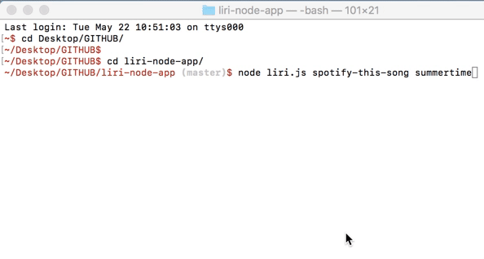

# Liri Node App

## Getting Started

LIRI is like iPhone's SIRI. However, while SIRI is a Speech Interpretation and Recognition Interface, LIRI is a Language Interpretation and Recognition Interface. LIRI is a command line node app that takes in parameters and gives you back data.

### Example

### Prerequisites

node modules
npm packages 
2.86.0
5.0.1
1.0.7
1.7.1

## Built With

* javascript
* twitter API
* spotify API
* OMDB API

## Author

* **Jessica Brush** - *Initial work* - [dandiflower](https://github.com/dandiflower)

## License

This project is licensed under the MIT License - see the [LICENSE.md](LICENSE.md) file for details

## Acknowledgments

* Berkeley coding bootcamp

